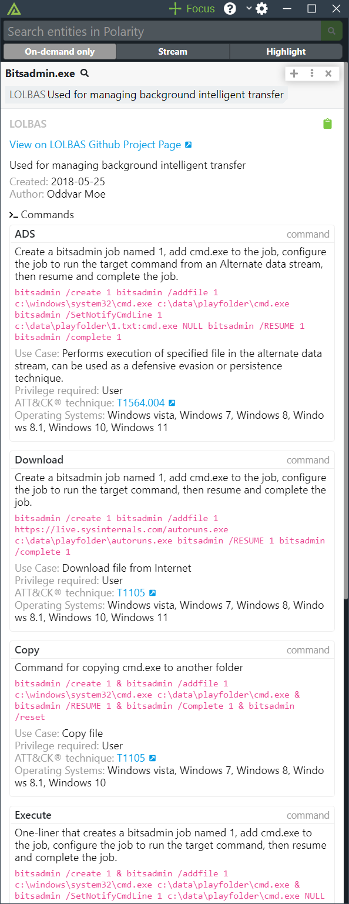
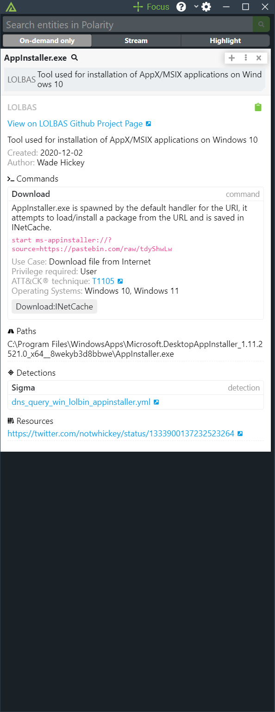

# Polarity LOLBAS Integration

The Polarity - LOLBAS Integration returns information on Living off the Land Binaries, Scripts and Libraries. 

The integration requires network access to the LOLBAS JSON file available here: https://lolbas-project.github.io/api/lolbas.json

The integration will automatically refresh the list every night at midnight server time. For example, for a server set to use UTC (oftentimes the default), the integration will update the LOLBAS List at 00:00 UTC which would be 20:00 EST, or 17:00 PST.  The list loading process takes several seconds to complete.  If a user runs a search while the integration is reloading data, the user will receive a message asking them to retry their search in a few minutes.

The list is also reloaded any time the integration is restarted after the first search is run.

To learn more about LOLBAS, please visit https://lolbas-project.github.io/#

Check out the integration below:

|  |  |
|----------------------------|----------------------------|
| *Example 1*                | *Example 2*                |

## Installation Instructions

Installation instructions for integrations are provided on the [PolarityIO GitHub Page](https://polarityio.github.io/).

## Polarity

Polarity is a memory-augmentation platform that improves and accelerates analyst decision making.  For more information about the Polarity platform please see:

https://polarity.io/